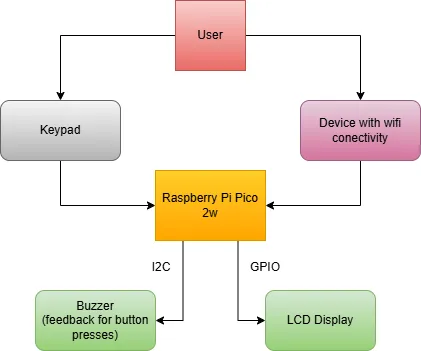

# Rust Calculator 
A calculator that take numbers and opperations as inputs and outputs results and can use wifi

:::info 

**Author**: Scrob Sebastian-Mina \
**GitHub Project Link**: https://github.com/UPB-PMRust-Students/project-Seby-S/tree/main

:::

## Description

This project implements a calculator using a Raspberry Pi Pico 2w microcontroller running rust code.
It supports:

- **Basic arithmetic**: addition, subtraction, multiplication, division  
- **More advanced functions**: exponentiation, square roots, and (in future iterations) trigonometric operations  
- **Wifi connectivity**: ability to connect to a pc and recive input or sent an output  
- **Graphical interface**: an LCD display(with blue backlight) for on device feedback  
- **Audible feedback**: buzzer beeps confirm key presses

Input comes from a 4x4 matrix keypad and output is drawn via embedded-graphics primitives on the LCD and signaled through a buzzer.


## Motivation

I wanted to make something practical for my project and I use calculators all the time in my student life. I also like simple user input/output devices.

## Architecture 



### Components

- **Raspberry Pi Pico 2w**: connected to everything and runs code, has wifi functionality
- **Keypad**: connect with GPIO pins
- **LCD display**: connect with GPIO pins and uses I2C
- **Buzzer**: connect with GPIO pins


## Log

<!-- write every week your progress here -->

### Week 5 - 11 May
Parts have arived and got the bords to work.

### Week 12 - 18 May
Coding for the dispaly and keypad is in progress.

### Week 19 - 25 May
WIP

## Hardware
- Raspberry Pi Pico 2W (RP2350): Main microcontroller handling system logic, display and wifi functionality  
- LCD 1602 I2C, blue backlight: 16x2 character display for UI and results  
- Keypad: user input for numbers and operations  
- 3V active buzzers: audio feedback for key presses  
- Breadboard & jumper wires for prototyping


### Schematics


### Bill of Materials

<!-- Fill out this table with all the hardware components that you might need.

The format is 
```
| [Device](link://to/device) | This is used ... | [price](link://to/store) |

```

-->

| Device | Usage | Price |
|--------|--------|-------|
| [Raspberry Pi Pico 2W](https://www.raspberrypi.com/documentation/microcontrollers/raspberry-pi-pico.html)  | The microcontroller | [39 RON](https://www.optimusdigital.ro/en/raspberry-pi-boards/13327-raspberry-pi-pico-2-w.html)  |
| LCD 1602 cu Interfata I2C si Backlight Albastru | output | [16 RON](https://www.optimusdigital.ro/ro/optoelectronice-lcd-uri/2894-lcd-cu-interfata-i2c-si-backlight-albastru.html) |
| Tastatura matriceala 4x4 | input | [7 RON](https://www.optimusdigital.ro/ro/senzori-senzori-de-atingere/470-tastatura-matriceala-4x4-cu-conector-pin-de-tip-mama.html) |
| 2x Buzzer Activ de 3 V | audio feedback | [2 RON](https://www.optimusdigital.ro/ro/audio-buzzere/635-buzzer-activ-de-3-v.html) |
| Breadboard HQ (830) | platform | [10 RON](https://www.optimusdigital.ro/en/breadboards/8-breadboard-hq-830-points.html) |
| Set Fire | wires | [8 RON](https://www.optimusdigital.ro/ro/fire-fire-mufate/12-set-de-cabluri-pentru-breadboard.html) |
|||Total: 82 RON |

## Software

| Library | Description | Usage |
|---------|-------------|-------|
| [embassy-rp](https://docs.embassy.dev/embassy-rp/git/rp2040/index.html) | Peripheral access library | Used for accessing the peripherals |
| [embedded-graphics](https://docs.embassy.dev/embassy-rp/git/rp2040/index.html) | 2D graphics librarys | For LCD display |
| [gpio](https://docs.embassy.dev/embassy-stm32/git/stm32c011d6/gpio/index.html) | GPIO | Used for interacting with GPIO pins |
|wip|||


## Links

<!-- Add a few links that inspired you and that you think you will use for your project -->

1. [Embedded-Graphics Documentation](https://github.com/embedded-graphics/embedded-graphics)  
2. [RP2040 Datasheet](https://datasheets.raspberrypi.com/rp2040/rp2040-datasheet.pdf)  
3. [Rust Embedded Book](https://docs.rust-embedded.org/book/)


